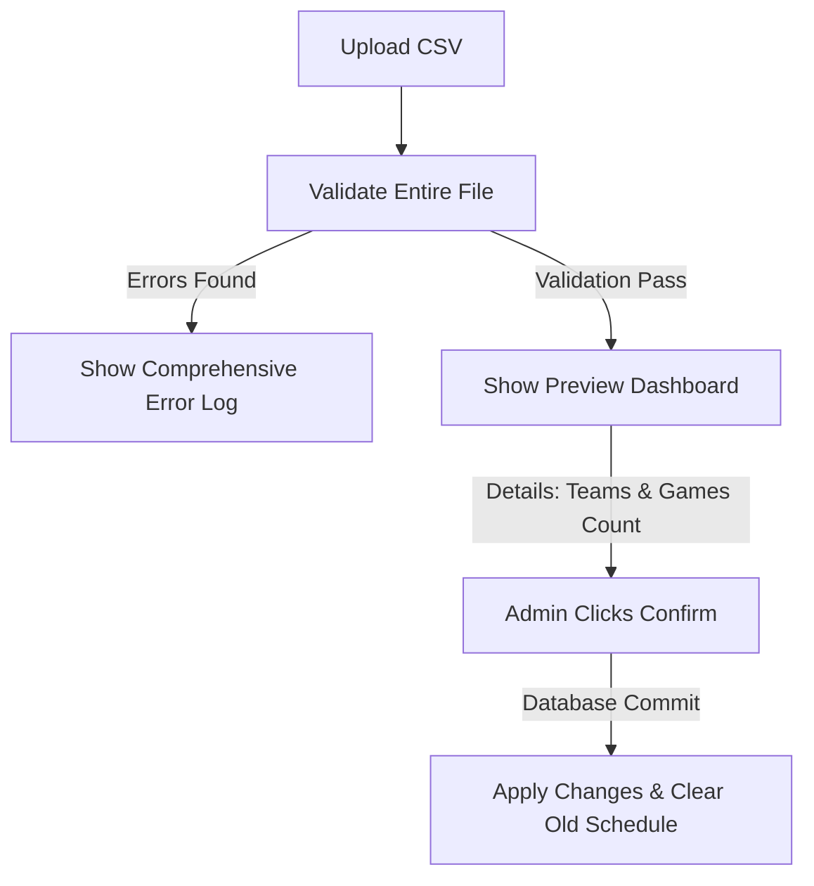

# ⚽ CSV Schedule Import Specification

The **CSV Schedule Import** feature allows administrators to upload a **Schedule Match Report** exported from **SportsConnect (Soma)** to automatically populate a season's divisions, teams, and game schedules.

---

## 📋 1. SportsConnect CSV Column Mappings

The CSV processor (`CsvImportService`) maps rows to an internal `CsvGameRowDto` based on standard SportsConnect report headers:

| CSV Column Header | DTO Property | Type / Format | Purpose |
| :--- | :--- | :--- | :--- |
| **Match ID** | `MatchId` | `string` | Unique tracking/debugging identifier for the fixture. |
| **Event Name** | `EventName` | `string` | Contains the division structure, e.g., `"Region 42 Fall 2025 - 12U - Girls (Games)"`. |
| **Group Name** | `GroupName` | `string` | Supplementary group classification. |
| **Home Team** | `HomeTeam` | `string` | Full name of the home team or `"Practice"`. |
| **Away Team** | `AwayTeam` | `string` | Full name of the away team (empty for practice). |
| **Date** | `Date` | `string` (`MM/DD/YYYY`) | Date of the game. |
| **Start Time** | `StartTime` | `string` (`h:mm tt`, e.g. `"6:30 PM"`) | Kick-off time. |
| **End Time** | `EndTime` | `string` (`h:mm tt`) | Concluding time. |
| **Field** | `Field` | `string` | Specific field assignment (e.g., `"DV 3A"`, `"Borchard C"`). |
| **Location** | `Location` | `string` | Name of the venue/park (e.g., `"Dos Vientos Community Park"`). |
| **Home Team Head Coach First Name** | `HomeTeamHeadCoachFirstName` | `string` | First name of home head coach. |
| **Home Team Head Coach Last Name** | `HomeTeamHeadCoachLastName` | `string` | Last name of home head coach. |
| **Away Team Head Coach First Name** | `AwayTeamHeadCoachFirstName` | `string` | First name of away head coach. |
| **Away Team Head Coach Last Name** | `AwayTeamHeadCoachLastName` | `string` | Last name of away head coach. |
| **Scheduled Status** | `ScheduledStatus` | `string` | Game scheduling status. |

---

## 🔍 2. Event Filtering & Cleaning Rules

To prevent external clutter from invading the tracking tables, the import service enforces the following ingestion logic:

1.  **Event Name Constraints:** Only rows where the `EventName` contains the word **`(Games)`** (case-insensitive substring) and mentions one of the supported regional age groups (**`10U`**, **`12U`**, or **`14U`**) are parsed.
2.  **Practice Events Bypassed:** Any row with a `HomeTeam` value matching `"Practice"` or where the `AwayTeam` is blank is ignored.
3.  **Gender Extraction:** Genders are dynamically extracted from the `EventName` according to whether the word `"Boys"` or `"Girls"` is matched, translating to the `Gender` enum.

---

## 🚫 3. Rigid Pre-Import Validation

To ensure database consistency, the import engine operates on a **"All-or-Nothing"** validation design:
*   Instead of failing on the first error, the service parses the entire CSV file, cataloging every single structural, relational, and format issue.
*   **All errors** are displayed on the screen at once to allow the admin to fix the spreadsheet in SportsConnect or locally before trying to upload again.
*   *Validation Checks include:* Checking that the designated Season exists, parsing dates/times into local `DateTime` offsets, extracting division identifiers, verifying that team names are present, checking for valid locations, and detecting overlapping games on the same division or field.

---

## 🏷️ 4. Team ShortName Generation Logic

Because full team names in SportsConnect (e.g. `12UG02 Thunder Storm United (Martinez)`) are too long for mobile standings displays, the `CsvImportService` applies a smart "ShortName" extraction algorithm:

### Pattern A: Standard Format with "Fun" Name
*   *Input Template:* `[AgeGroup][Gender][TeamNumber] [FunName] ([CoachLastName])`
	*   Example: `"10UB01 Jets (Smith)"`
*   *Output:* `[TeamNumber] [FunName]` (e.g., `"01 Jets"`)

### Pattern B: No "Fun" Name
*   *Input Template:* `[AgeGroup][Gender][TeamNumber] ([CoachLastName])`
	*   Example: `"12UG02 (Johnson)"`
*   *Output:* `[TeamNumber] [CoachLastName]` (e.g., `"02 Johnson"`)

### Pattern C: Fallback Standard Truncation
*   *Input Template:* Any non-matching or arbitrary team name.
	*   Example: `"Very Long Team Name That Exceeds The Limit"`
*   *Output:* The name is preserved up to **20 characters**, with the 20th character replaced by an ellipsis (`…`) if it exceeds the limit.

---

## 🔄 5. Two-Step Import Preview and Replacement Logic

To protect existing data from destructive updates, the CSV feature utilizes a secure workflow:

### The Replacement Policy:
When the administrator clicks "Confirm Import" for an active season:
1.  **Soft-delete/Purge Old Data:** The service identifies all existing Teams, Games, and Scores specifically associated with the target Season/Divisions.
2.  **Verify Scores Safeguard:** If scores have already been recorded for games in that season/division, the import is **blocked** to prevent accidental loss of real-time point-of-time standings.
3.  **Insert Fresh Schedule:** Once safely cleared, the verified Team assets and schedule games are committed to the PostgreSQL datastore in a single database transaction.
